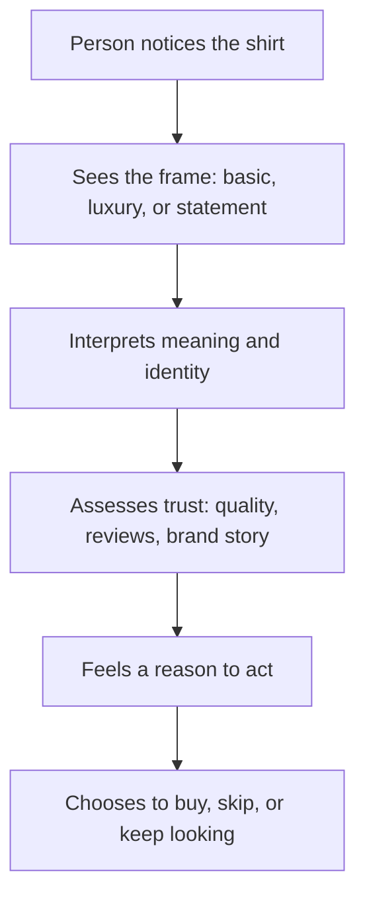

# Chapter 1: Persuasion, Branding, and Design

A plain white T-shirt looks simple. It is just cotton, a neckline, and a few seams. And yet the same shirt can be sold as a basic, a luxury item, a political statement, or a wearable canvas. That is the heart of persuasion: the same object can be made to mean different things depending on how it is presented, framed, and connected to a person’s needs and values.

Design is not only about appearance. It is also about guiding attention, shaping interpretation, building trust, and encouraging action. Persuasion is a tool for doing those things responsibly. It helps people understand what they are seeing, why it matters, and what choice makes sense.

## What Persuasion Is

Persuasion is the process of influencing someone’s attention, interpretation, trust, and action without using force. It is not just saying, “Buy this.” It is helping another person notice a problem, understand a value, feel confidence, and see a reason to act.

A persuasive message can do several things at once:

- direct attention to what matters
- influence how something is interpreted
- create or strengthen trust
- make a decision feel reasonable or urgent
- move someone toward a choice that matches their goals

A designer who understands persuasion is not simply a salesperson. A designer is often helping a user understand a system, a brand, or an experience. In that sense, persuasion is part of communication, not just marketing.

## Persuasion, Coercion, and Manipulation

Persuasion is different from coercion and manipulation.

- Persuasion gives information, frames meaning, and invites choice.
- Coercion uses pressure, threat, or force to remove real choice.
- Manipulation hides the real intent, exploits vulnerability, or distorts information to make a person decide against their actual interests.

A good example is a T-shirt sale. If a brand says, “This shirt is comfortable, durable, and made for everyday wear,” that is persuasion. If a salesperson says, “You have to buy this now or you will miss out,” that is closer to pressure and urgency. If a brand uses fake scarcity and dishonest reviews to trick a buyer, that is manipulation.

The key difference is agency. Persuasion respects the other person’s ability to decide. Coercion removes that choice. Manipulation works around it.

## A Recurring Example: The Plain White T-Shirt

Consider one white T-shirt. It is physically the same in every version: a simple cotton shirt. But the story around it can change everything.

- A clothing brand might present it as a “daily essential” for comfort and practicality.
- A premium label might present it as a “minimal luxury” item with fine fabric and excellent fit.
- A creative studio might frame it as a blank canvas for self-expression.
- A social cause campaign might use the shirt as a symbol of solidarity or public support.

The shirt itself did not change. What changed was the framing: the message, the audience, the values, the cues, and the emotional meaning attached to it.

This is useful for designers because a product’s value is not created only by its material features. Value is also created by context, narrative, and perception.

## Robert Cialdini’s Principles of Influence

Robert Cialdini’s work is a useful introduction to how people are influenced in everyday life. His major principles are memorable because they describe patterns people often follow without fully noticing them.

### 1. Reciprocity

People tend to feel obliged to return favors or kindness. If someone gives us something, we often feel a pull to give back.

Example: A brand sends a free sample or helpful guide. The customer may feel more positive toward the brand and more likely to make a purchase.

### 2. Scarcity

People value things more when they seem limited or time-sensitive. Scarcity creates urgency.

Example: A shirt is described as “limited run” or “available for this week only.” The same shirt may feel more desirable because the buyer senses a deadline.

### 3. Authority

People are more likely to trust signals of expertise, competence, and credibility.

Example: A clothing brand with a clear focus on fabric quality, production process, and craftsmanship may seem more trustworthy than a vague brand with no explanation.

### 4. Consistency and Commitment

People like to act in ways that match their previous choices, values, or self-image. Once they say or do something, they often prefer to stay consistent.

Example: A person who says they care about sustainable clothing may later be more willing to choose a brand that reflects that value.

### 5. Liking

People are more likely to be persuaded by people or brands they find familiar, attractive, pleasant, or similar to themselves.

Example: A brand using friendly photography, relatable language, and honest storytelling often feels more persuasive than one that feels cold or distant.

### 6. Social Proof

People look to others when deciding what is normal, safe, or valuable. Reviews, testimonials, and visible popularity matter.

Example: A T-shirt labeled as “best seller” or featuring a large number of positive reviews may feel more trustworthy than a product with no social evidence.

These principles are not inherently unethical. They become risky when they are used to hide information, exploit vulnerability, create false urgency, or pressure people into choices they do not actually understand.

## Beyond Cialdini: Additional Useful Concepts

Cialdini gives a strong foundation, but persuasion is broader than a short list of tricks. Designers also benefit from ideas from psychology, rhetoric, and communication.

### Framing and Loss Aversion

Framing changes the meaning of the same fact. A T-shirt can be framed as “essential,” “luxury,” or “statement piece,” even though it is still a cotton shirt. People respond differently depending on how the choice is presented.

Loss aversion is the tendency to feel the pain of losing something more strongly than the pleasure of gaining something. This is why phrases such as “don’t miss out” or “limited availability” can feel powerful. In an ethical context, this is useful when the information is real and the urgency is honest. In an unethical context, it creates artificial panic.

### Ethos, Pathos, and Logos

Classical rhetoric offers another useful lens:

- Ethos refers to credibility and trust.
- Pathos refers to emotion and identification.
- Logos refers to logic, reason, and clear evidence.

A persuasive design system often needs all three. A shirt with a strong story needs ethical credibility, emotional resonance, and clear practical value. A brand that only relies on emotion without substance may feel shallow. A brand that only relies on logic without emotional meaning may feel cold.

A plain white T-shirt can appeal to ethos through transparent materials and good craftsmanship, to pathos through a story of everyday use or personal identity, and to logos through durable fabric, simple fit, and honest pricing.

## A Simple Comparison

| Principle or concept | How it works | Ethical use | Misuse risk |
| --- | --- | --- | --- |
| Reciprocity | People feel compelled to return a favor | Offer helpful content, samples, or sincere value | Guilt-tripping or creating obligation without real value |
| Scarcity | Limited availability feels more valuable | Honest stock limits or event-based scarcity | Fake urgency or artificial countdowns |
| Authority | Expertise builds trust | Show clear expertise and transparent process | Using false credentials or prestige without substance |
| Consistency | People want decisions to match prior values | Invite small, real commitments that fit a person’s values | Pressuring people into decisions that do not fit them |
| Liking | We trust what feels familiar and pleasant | Build warm, human, clear communication | Manipulating personal affinity or using flattery as a trap |
| Social proof | People copy what others do | Use real reviews and evidence of community support | Fake testimonials and inflated popularity |
| Framing | Meaning changes with context | Present facts clearly and honestly | Distorting the meaning of the product through selective emphasis |
| Ethos / Pathos / Logos | Persuasion works through trust, emotion, and reason | Balance credibility, feeling, and logic | Overusing emotion or authority without evidence |

## Decision Journey: A White T-Shirt in Context

This diagram is simple, but it shows the real logic of persuasion. A person does not decide only on fabric or fit. They also decide based on how the design communicates value, meaning, and trust.

## Ethical Cautions

Persuasion is powerful, and power should be handled carefully. Ethical persuasion is transparent, respectful, and focused on real value rather than vulnerability.

A few warnings are worth keeping in mind:

- Avoid using fear when the fear is exaggerated or manufactured.
- Do not hide material information or important tradeoffs.
- Do not create fake urgency if the product is not actually limited.
- Do not rely on emotional pressure to bypass a person’s reasoning.
- Do not treat the audience as a target to be manipulated rather than a person to be informed.

In design, the best persuasive work often feels lightweight and honest. It helps a person decide with confidence, not confusion.

## Questions to Ask Before Trying to Persuade

Before creating a persuasive design, ask:

- What problem am I really helping the audience solve?
- What does this audience actually value, not what do I want them to value?
- Am I presenting the truth clearly, or am I framing it selectively?
- Am I asking for an action that is fair, informed, and aligned with the user’s interests?
- Am I using urgency, social proof, or authority honestly?
- What would the user think if I explained this design choice out loud?
- Is this message helping people make a better choice, or am I simply trying to trigger a quick sale?

Good persuasion is not only effective. It is also responsible.

## The T-Shirt as a Design Problem

The plain white T-shirt is a useful case study because it is nearly universal and easy to overlook. It can be marketed as a basic, a luxury staple, a comfort garment, an art surface, or a public symbol. The same product becomes different when the designer changes the framing.

A persuasive designer does not simply ask, “How do I make this look better?” A better question is, “What story does this object carry, and what decision am I trying to help the audience make?”

That is why branding matters. Branding is not just the logo on the shirt. It is the set of meanings attached to the shirt: who it is for, what it says, why it matters, and why it deserves trust.

## Explore Further

If you want to continue this topic, look for search terms such as:

- Cialdini principles of influence summary
- persuasion vs manipulation examples
- framing effect in marketing and design
- loss aversion in behavioral economics
- ethos pathos logos explained for beginners
- ethical marketing and consumer trust

## What You Should Remember

Persuasion is not the same as force or manipulation. It is the practice of shaping attention, interpretation, trust, and action in a way that respects the other person’s ability to choose.

The white T-shirt shows that meaning can be created without changing the object itself. A designer’s job is often to decide what story the object tells and whether that story is honest, useful, and humane.

The most effective persuasion is grounded in clarity, credibility, and care. If a message helps people understand the value of a choice and makes that choice more informed, it is more likely to be persuasive in the best sense.
