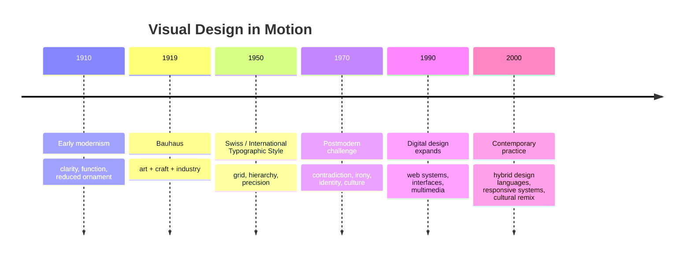

# Chapter 3: Design Language and Visual Meaning

Visual design is not just decoration. It is a way of organizing attention, creating meaning, and shaping how a person experiences a product, a page, or a brand. A button, a grid, a type choice, a color palette, or the spacing around an object all carry ideas. Even the absence of ornament can communicate a philosophy.

This chapter looks at a major historical tension in design: the effort to make things clear, rational, and universal versus the desire to make them expressive, personal, and culturally alive. That tension is not just academic. It continues in contemporary web design, app interfaces, editorial layouts, and product branding.

## A Short History of Visual Language

Visual design history is not a simple march from one style to the next. It is a series of arguments about what design should do: clarify information, express identity, structure culture, or complicate it. The modernist impulse favored order, legibility, and universality; later movements pushed back against that certainty and asked how design could also carry meaning, contradiction, and cultural specificity.

### Early Modernism

Early modernism grew out of a desire to reject decoration for decoration’s sake. Designers and artists looked for honesty, clarity, and a more direct relationship between form and function. They believed visual order could make the world easier to understand.

This period often favored:

- simple geometric forms
- strong contrast
- clean structure
- objective communication
- a clear separation between function and ornament

In design, this often meant that the message was meant to be immediately legible. The viewer was not asked to decode hidden symbolism so much as to receive the information clearly and efficiently.

A plain white T-shirt in a modernist presentation might be shown as a pure, simple object: crisp, disciplined, minimal, and stripped of excess. The shirt feels like a well-made basic because the design language around it emphasizes neutrality, precision, and utility.

### Bauhaus

The Bauhaus is one of the most important references in modern design history. It brought together art, craft, and industry, and it advanced the idea that design should serve everyday life while still being intellectually serious.

The Bauhaus approach emphasized:

- functional design
- integration of art and manufacturing
- systematic thinking
- the relationship between form and use
- clarity in visual communication

This was not a simple “less is more” slogan. The Bauhaus was more interested in how design could become a disciplined, practical, and humane discipline. It valued rational structure, but it also believed design could be socially useful.

The Bauhaus did not treat form as a luxury. Form was part of how a design solved a problem.

### Swiss / International Typographic Style

The Swiss or International Typographic Style emerged in the mid-20th century and carried modernist thinking into typography and editorial systems. It became known for systematic grids, asymmetrical layouts, sans-serif type, and disciplined use of negative space.

Key features included:

- grid-based layouts
- objective typographic hierarchy
- strong alignment and spacing
- minimal decoration
- emphasis on readability and neutrality

This style strongly influenced design education and contemporary branding. It often signaled clarity, efficiency, and confidence. In a world of information overload, it offered a sense that structure could help people understand complexity.

A designer could present the same white T-shirt in a Swiss style with strict alignment, carefully placed type, minimal color, and generous margins. The shirt would feel precise, rational, and universal.

### Postmodernism

Postmodernism is partly a reaction against the certainty and universality often associated with modernism. It challenges the idea that one visual system can speak clearly and equally for everyone. It questions objectivity, hierarchy, and the idea that restraint is automatically more honest or more intelligent.

Postmodern design often embraces:

- contradiction
- irony
- collage
- recognizably cultural references
- playful distortion
- emotional or symbolic complexity

It does not reject clarity entirely. Rather, it asks whether clarity alone is enough. If design becomes too rigid, too universal, or too certain, it may also become detached from lived experience, contradiction, and identity.

A postmodern presentation of the same white T-shirt might use layering, playful typography, exaggerated proportions, references to other visual styles, or a deliberately messy composition. The shirt would not feel like a neutral basic. It would feel like a cultural object, a statement, or a performance.

## The Ongoing Tension

Modernism and postmodernism are not historical phases that ended neatly. The real story is a continuing tension between opposites.

### Order and disruption

Design often must decide whether to establish clarity through structure or create energy through interruption. A grid offers order. A broken grid can create tension. Both can be effective if the intention is clear.

### Universality and identity

Some designers aim for a clear system that works across many contexts. Others value cultural specificity, personal voice, and differences in audience experience. The design question is not whether one side is always right. It is whether the work is speaking to the right audience in a credible way.

### Clarity and expression

A sharp layout can make information easier to read, but a highly expressive design can create emotional depth. A good design system often balances legibility with personality.

### Grid and anti-grid

The grid is a tool for order, pacing, and structure. The anti-grid suggests chaos, play, or a more intuitive visual rhythm. The designer’s challenge is to decide when structure helps and when it becomes sterile.

### Restraint and abundance

Minimal design can signal confidence and focus. Abundant design can signal richness, emotion, or complexity. Both can feel intentional. The issue is whether the visual language matches the content and audience.

### Function and irony

Design can be practical and sincere, but it can also use irony as a way to comment on culture, status, or expectation. A design can be genuinely useful while also signaling knowingness or critique.

These tensions continue in contemporary web and product design. A modern website may emphasize clean hierarchy, whitespace, and predictable navigation. A more postmodern product may use bold asymmetry, layered media, playful motion, or culturally loaded references. The best design often does not choose one extreme. Instead, it finds a productive balance tailored to the task, audience, and message.

## Comparison Table

| Movement or style | Main idea | Typical visual features | Strength | Risk |
| --- | --- | --- | --- | --- |
| Early modernism | Form should follow function and communicate clearly | Simplicity, structure, reduced ornament | Legibility and honesty | Can feel cold or too rigid |
| Bauhaus | Design can unite art, craft, and industry | Functional systems, geometric order, practical creativity | Social usefulness and discipline | Can feel overly rational |
| Swiss / International Style | Clarity through systematic typography and grids | Sans-serif type, asymmetry, precise hierarchy | Strong information design | Can feel impersonal or generic |
| Postmodernism | Rejects total certainty and embraces complexity | Layering, contradiction, irony, collage | Cultural energy and expression | Can feel chaotic or self-conscious |
| Contemporary design | Mixes older tensions and styles intentionally | Hybrid systems, responsive layouts, expressive UI | Flexibility and relevance | Can lose coherence without a clear purpose |

## A Timeline of Key Design Shifts

This timeline is not a story of one style replacing another. It is a history of recurring arguments. Design keeps asking: How much order is useful? How much expression is honest? How much universal clarity can a system support before it loses humanity?

## How to Read a Design

When you look at a design, ask more than, “Does it look good?” Try reading it like a cultural object.

Ask yourself:

- What is the visual hierarchy? What are the first things the eye sees?
- What is being emphasized, and what is being hidden?
- Is the design trying to look objective, expressive, or ironic?
- What assumptions does the design make about the audience?
- Is the layout organizing information clearly or producing tension intentionally?
- Is the design using a grid to create order or breaking the grid to create disruption?
- Does the design feel universal, or does it seem rooted in a particular identity or culture?
- Are the choices functional, emotional, rhetorical, or political?

A design is not neutral just because it is clean. A design is not automatically expressive just because it is noisy. The most interesting work often reveals its logic and its values.

## Museum Research

Design history is easier to understand when you look at actual objects rather than only summaries. If you want to study authentic examples, use museum and institutional collections where the objects and archives are carefully documented.

Search for:

- Bauhaus objects and design works
- Swiss graphic design posters and publications
- modernist typography exhibitions
- postmodern graphic design examples
- museum collections of design, typography, and architecture
- institutional collections such as The Metropolitan Museum of Art, MoMA, Cooper Hewitt, V&A, Bauhaus archives, and other reputable museum collections

Use search terms such as:

- Bauhaus poster design
- Swiss International Style typography
- modernist graphic design exhibition
- postmodernism design examples
- grid systems in design history
- museum collection typography modernism

When you find a result, verify the actual object, collection, date, and institution yourself. Do not rely on a blog post or a social media summary as your only source. Museum and archive collections are useful starting points because they often include clear documentation and context.

## The Same White T-shirt, Two Design Languages

The plain white T-shirt is a useful example because it is visually simple, but it can carry very different meanings depending on the design language around it.

### Modernist presentation

A modernist presentation might show the shirt with strong framing, disciplined spacing, minimal typography, and a very clean layout. It may feel like a universal, honest, efficient product. The message is: simple is good, function is clear, and quality is visible through restraint.

This makes the shirt feel like a reliable essential. It does not ask the viewer to decode a complex identity. It invites confidence and trust.

### Postmodern presentation

A postmodern presentation might layer different type treatments, use playful contradiction, incorporate collage or stylized distortion, or create a deliberately uneven rhythm. The shirt would feel less like a neutral item and more like a cultural object or a statement. The message is: this is not just functionality; this is identity, irony, and a reaction against blandness.

The exact same shirt now feels less like a basic and more like a performance of style, critique, or personality.

The key point is that design language changes perception. Form and context create meaning, not just the object itself.

## What You Should Remember

Design is a language. It is not only about aesthetics; it is about how visual choices organize attention, create meaning, and signal values. The history of design is full of debates about whether form should be functional, emotional, universal, or culturally specific.

Modernism pushed for clarity, order, and rational structure. Postmodernism challenged the idea that those values should be absolute, arguing that identity, contradiction, and expression also matter. The tension between them continues in contemporary web design, interfaces, branding, and product storytelling.

The same plain white T-shirt can look like a disciplined essential or a playful cultural object depending on the design language around it. That is the point: visual systems do not merely decorate objects. They tell us how to think about them.
