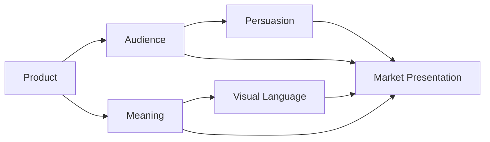

# Chapter 4: The White T-Shirt Case Study

A plain white T-shirt is one of the easiest products in the world to underestimate. It is simple, familiar, and physically ordinary. Yet it can be transformed into a luxury object, a durable essential, a symbol of rebellion, a wearable act of creativity, or a statement of cultural identity. The reason is not that the shirt changes. The reason is that the presentation changes.

This chapter takes one imaginary product — an ordinary high-quality plain white T-shirt — and shows how radically different market presentations can be built around the same physical object. The goal is not to pretend a shirt is magically different. The goal is to show how meaning is designed.

The key question is always the same:

What are customers being invited to feel, imagine, or become by buying this shirt?

## Concept 1: The Explorer Edition

### Audience
Young travelers, remote workers, weekend hikers, and people who want a wardrobe that feels ready for movement.

### Chosen brand archetype
Explorer

### Persuasion principles being used
- Social proof: “People like you are choosing this for real life.”
- Scarcity: small run, travel-tested, seasonal release.
- Liking: warm, outdoorsy imagery and relatable language.

### Visual-design language
A rugged, airy, tactile visual system. Natural color palette, minimal product labels, weathered textures, wide spacing, and photography of real places rather than polished studio backdrops.

### Headline
“Made for the road, the trail, and the everyday detour.”

### Short product story
This shirt is not a polished wardrobe item. It is gear for people who prefer lived experience over curated perfection. It is made for movement, outdoor thinking, and comfortable reliability. The customer is invited to imagine themselves as someone who is not trapped by routine, someone who moves through the world with curiosity and ease.

### Imagery direction
Photographs of the shirt worn while walking, resting on a bench outside a station, hanging on a cabin door, or photographed against rough textures like stone, denim, and weathered wood. The images should feel grounded and natural, not fashion-magazine perfect.

### What meaning the customer is actually being invited to buy
A lifestyle of freedom, mobility, and genuine use. The shirt promises not just comfort, but a self-image: “I am adaptable, active, and not overly controlled by social codes.”

### Ethical concern or possible misuse
The brand may overstate ruggedness or imply that buying the shirt makes someone adventurous, even if the buyer mostly wears it around the city. The risk is that the shirt becomes a costume for aspiration rather than a product with honest usefulness.

## Concept 2: The Swiss Modernist Essential

### Audience
Professionals, students, office workers, and people who value order, quality, and clarity.

### Chosen brand archetype
Sage or Ruler, with a restrained modernist leaning

### Persuasion principles being used
- Authority: expertise, material honesty, precise language
- Consistency: a disciplined wardrobe built around simple essentials
- Social proof: understated product reviews and practical use cases

### Visual-design language
Swiss or International Typographic Style: disciplined grid, asymmetrical balance, sans-serif typography, generous whitespace, restrained color palette, minimal decoration, strong hierarchy.

### Headline
“Essential form. Thoughtful material. Lasting use.”

### Short product story
This is a shirt for people who prefer intention over noise. It is made to be lived in, not displayed like a trophy. The focus is on fabric quality, structure, fit, and clarity. The customer is invited to imagine themselves as organized, discerning, and confident in understated choices.

### Imagery direction
Close-up product photography with precise cropping, white background, careful spacing, and typography that feels editorial rather than decorative. The shirt is framed like a well-made object, not a personality costume.

### What meaning the customer is actually being invited to buy
The customer is buying clarity, competence, and credibility. The shirt represents an identity built on quality, restraint, and good judgment rather than spectacle.

### Ethical concern or possible misuse
This approach can become excessively sterile or performatively “minimal.” It risks suggesting that only a rational, controlled person is worthy of good design. It may also rely on subtle prestige signaling rather than genuine value.

## Concept 3: The Rebel Statement

### Audience
Students, artists, nightlife audiences, and people who want visible difference without loud branding.

### Chosen brand archetype
Rebel

### Persuasion principles being used
- Scarcity: limited release, small batch, collectible feel
- Social proof: “seen on the scene,” peer validation
- Liking: anti-establishment aesthetics feel authentic to a group identity

### Visual-design language
Disruptive or postmodern. Layered type, uneven composition, rough textures, cropped imagery, worn printing, collaged elements, and deliberate tension between clean structure and visual disturbance.

### Headline
“Not a uniform. A refusal.”

### Short product story
This shirt is not meant to disappear into a closet. It is meant to interrupt a room, challenge the template, and make a person feel like they are not simply following fashion — they are creating a presence. The product is sold as a refusal of bland consistency and a claim to independent identity.

### Imagery direction
Street photography, gritty textures, off-center cropping, layered type overlays, rough edges, and images with intentional visual conflict. The shirt might appear against a concrete wall, a dark alley, or a chaotic but stylish environment.

### What meaning the customer is actually being invited to buy
The customer is buying defiance, distinction, and symbolic independence. The shirt promises not just clothing, but permission to reject the expected narrative of taste.

### Ethical concern or possible misuse
A rebellious brand can become cynical or performative. It may encourage identity through opposition alone, which can drift into empty provocation. The risk is a brand that sells “being different” without offering any real value or sincerity.

## Concept 4: The Creator’s Canvas

### Audience
Artists, students, makers, and people who see clothing as a surface for self-expression.

### Chosen brand archetype
Creator

### Persuasion principles being used
- Consistency: “You are the kind of person who makes things.”
- Authority: craft language, design process, material knowledge
- Liking: approachable, creative, human storytelling

### Visual-design language
Expressive, open, and flexible. Warm editorial layout, collage, hand-drawn marks, mixed typography, experimental spacing, and a visual system that feels crafted rather than mass-produced.

### Headline
“Blank enough to become yours.”

### Short product story
This shirt is a canvas for everyday creativity. It is the sort of garment that invites drawing, writing, altering, layering, and improvisation. It is not sold as a finished identity; it is sold as a starting point for self-expression. The customer is invited to imagine themselves as someone who creates rather than simply consumes.

### Imagery direction
The shirt photographed in studio scenes with sketchbook pages, paint marks, objects, layered textures, and hand-annotated surfaces. The look should suggest process, making, and experimentation rather than polished perfection.

### What meaning the customer is actually being invited to buy
The customer is buying agency and originality. The shirt promises not just wearability, but creative possibilities and the ability to shape a personal visual identity.

### Ethical concern or possible misuse
This concept can become too romantic about DIY creativity and too little about actual garment quality. The brand may also imply that creative identity is a matter of styling alone, which can hide gaps in product honesty or fairness.

## Concept 5: The Caregiver / Community Essential

### Audience
People who value comfort, shared values, social responsibility, and everyday usefulness.

### Chosen brand archetype
Caregiver

### Persuasion principles being used
- Reciprocity: useful content, thoughtful service, community support
- Trust: clear production values and honest communication
- Social proof: community stories and shared impact

### Visual-design language
Warm, human, approachable, and clear. Soft color palette, careful typography, friendly photography, and a straightforward layout that feels honest rather than dramatic.

### Headline
“Wear the everyday piece that keeps a little more humanity in the loop.”

### Short product story
This shirt is presented as a basic with a conscience. It is comfortable, well-made, and connected to a bigger value system. The brand emphasizes care, quality, and practical respect for everyday life. The customer is invited to imagine themselves as someone who values purpose, fairness, and belonging.

### Imagery direction
Natural portraits, close cropping, relaxed scenes, family or community gatherings, and honest depictions of ordinary use rather than luxury posing. The product should feel like a useful object within a lived life.

### What meaning the customer is actually being invited to buy
The customer is buying trust, comfort, and alignment with a community-centered value system. The shirt is less about spectacle and more about belonging and ethical consumption.

### Ethical concern or possible misuse
The brand may lean too hard on virtue signaling. A product can become a badge of moral identity without actually delivering meaningful social or environmental responsibility. The risk is using care as a marketing performance rather than a real operational principle.

## Synthesis Table

| Concept | Audience | Archetype | Persuasion style | Visual language | Core meaning sold |
| --- | --- | --- | --- | --- | --- |
| Explorer Edition | Travelers and active people | Explorer | Scarcity, social proof, liking | Natural, rugged, tactile | Freedom and lived experience |
| Swiss Modernist Essential | Professionals and students | Sage / Ruler | Authority, consistency, trust | Minimal Swiss grid | Clarity, competence, quality |
| Rebel Statement | Students and creatives | Rebel | Scarcity, social proof, identity signaling | Disruptive, postmodern, layered | Defiance and distinction |
| Creator’s Canvas | Artists and makers | Creator | Consistency, authority, liking | Expressive, collage-like, hand-crafted | Originality and agency |
| Caregiver / Community Essential | Everyday consumers and community-minded buyers | Caregiver | Reciprocity, trust, community proof | Warm, human, straightforward | Belonging and ethical practicality |

## Product + Audience + Meaning + Persuasion + Visual Language

This diagram makes visible something people often miss: a product is not just what is in the box. A market presentation is the result of several forces working together. The product has material reality, but the audience brings interpretation. Meaning is added through narrative, persuasion adds urgency or trust, and visual language turns that combination into a coherent emotional offer.

A plain white T-shirt can become a piece of travel gear, a design object, a rebellious statement, or a meaningful everyday essential depending on what combination of audience, meaning, persuasion, and design language the brand chooses.

## Why This Is Useful for Designers

The point of this case study is not that one presentation is “better” than the others. The point is that the same product can support many stories, and each story carries different risks and promises.

A designer who understands this can ask better questions:

- Who is this product actually for?
- What identity is it helping the customer imagine?
- What is the product promising beyond utility?
- Which persuasion tools are being used, and are they honest?
- Is the visual language reinforcing the same story as the copy and the product itself?

That is where branding becomes strategic. It is not just surface design. It is the careful shaping of meaning.

## What You Should Remember

The same physical product can support many different market presentations. A plain white T-shirt does not become a luxury item, a travel essential, a rebellious statement, or a canvas for creativity because its fabric changes. It becomes those things because the brand changes the story, the audience, the visual language, and the emotional invitation.

Designers are not simply arranging objects. They are shaping meaning. Persuasion becomes most useful when it helps people make an informed and honest choice, not when it manipulates them into a feeling they did not really understand.

The best product presentation is not the loudest one. It is the one whose message, audience, and visual language all point in the same direction.
