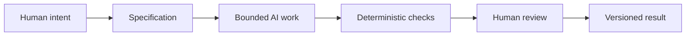

# Chapter 5: Synthesis — Persuasion, Archetypes, Design Language, and AI Work

The previous chapters have shown three related ideas at work in design and communication:

- persuasion helps answer: what response are we trying to enable?
- archetype helps answer: what meaning or identity are we expressing?
- design language helps answer: how should that meaning look and feel?

Taken together, these ideas form a practical framework for creative and technical work. They help explain not only how brands communicate, but also how teams make decisions, define goals, and shape outputs when AI is involved.

This final chapter turns those ideas into a working model. The goal is not to treat AI as magic. The goal is to understand how human intent, clear specification, disciplined process, and thoughtful review can guide AI toward useful results.

## One Framework for Direction

Think of the three ideas as a simple control system.

### Persuasion

Persuasion is about response. It asks: what action or attitude do we want to enable? Do we want the audience to trust, compare, choose, remember, support, or act?

A persuasive design is not simply loud. It is effective because it helps people understand what matters and why a decision makes sense.

### Archetype

Archetype is about meaning. It asks: what role are we helping the audience imagine, and what identity are we expressing? Is the brand or product a guide, a rebel, a creator, a caregiver, a sage, or something else?

Archetypes give shape to the emotional story behind a product or experience. They help answer why a person might want to belong to a brand rather than just buy a thing.

### Design language

Design language is about expression. It asks: how should this meaning feel, look, and be experienced visually? Should it be minimal and grid-driven? Editorial and crisp? Disruptive and ironic? Warm and human? Clear and functional? The answer depends on the audience and the meaning being expressed.

The three layers connect like this:

- persuasion gives us the desired response
- archetype gives us the intended meaning and identity
- design language gives us the visible form of that meaning

Together, they create a much stronger creative foundation than style alone.

## Why This Matters for AI-Assisted Work

AI can produce text, mockups, code, outlines, and concept variations quickly. That speed is useful, but speed without structure creates confusion. The best AI work does not begin with a blank page and a vague prompt. It begins with a clear problem and a bounded objective.

### Why an AI task should be bounded by a specification

A specification is a defined boundary: what the task is, what constraints matter, and what success looks like. It helps answer questions such as:

- What is this output for?
- Who is the audience?
- What tone and level of detail are expected?
- What is the deliverable format?
- What must not be included?
- What counts as acceptable output?

Without a specification, AI work is too likely to drift. It may produce something clever but unfocused, or persuasive but not honest, or visually polished but not useful. A bounded task gives the AI a clear direction and makes review easier.

A designer or developer using AI should define the problem before asking the model to generate. In other words, the human needs to provide intent, not just a request.

### Why Git provides traceability and recovery

Git gives a project continuity and memory. Every change can be tracked, reviewed, and revisited. This matters because creative work is iterative, and iteration is where confusion often grows.

When a team uses Git:

- changes are recorded over time
- versions can be revisited
- work can be compared and tested
- mistakes can be isolated and repaired
- collaboration becomes easier to understand

This is not just a technical convenience. It is also a form of accountability. If a design direction or writing draft changes, the reason for the change can be examined. If a bad change appears, the project can be recovered without losing the surrounding work.

### Why deterministic automated checks are useful

Deterministic checks are repeatable tests or validations that produce the same result when the same conditions are present. They are useful because they reduce uncertainty in a cheap and consistent way.

Examples include:

- checking that required sections exist
- validating markdown structure
- confirming files are linked or named correctly
- verifying that a task runs without errors
- checking that some output follows a defined template

Deterministic checks are valuable because they are cheap to run and easy to repeat. They do not replace judgment, but they give a reliable baseline. They allow the team to catch obvious problems quickly before a human makes a deeper assessment.

### Why AI review can be useful but probabilistic

AI review is useful for several reasons. It can quickly scan for missing sections, grammatical issues, consistency problems, or deviations from a requested template. It can help compare drafts and flag probable weak spots.

But AI review is probabilistic. That means it is not guaranteed to be correct. It may miss nuance, invent confidence, or judge a result based on patterns rather than real understanding. It can be useful as a second set of eyes, but it should not be confused with certainty.

This is where the race-car pit-stop metaphor is helpful.

## The Race-Car Pit-Stop Metaphor

A race car can continue moving at high speed because the team has systems and routines in place. But selected moments matter: a tire change, a fuel check, a brake inspection, a strategic decision about pace or risk. Those are moments where humans need to stop, assess, and decide deliberately.

Automation can keep the work running. It can validate structure, test logic, and catch obvious issues quickly. But humans remain responsible for the moments that require judgment: meaning, ethics, context, truthfulness, and final direction.

In a creative workflow, the pit stop is not a sign of failure. It is the point where the team asks:

- Are we building the right thing?
- Does this match the audience and purpose?
- Are we being honest and clear?
- Are we still aligned with the intent?

A thoughtful process combines speed with deliberate human intervention at the critical moments.

## Why Humans Remain Responsible

AI can generate, summarize, rewrite, and propose. But humans remain responsible for judgment, meaning, and ethical decisions.

That includes:

- deciding the real problem to solve
- choosing the audience and purpose
- writing or refining the specification
- interpreting context and cultural nuance
- checking the truthfulness of information
- deciding what claims are reasonable or risky
- accepting, revising, or rejecting outputs
- owning the final decision

AI may help with drafts, alternatives, and rough work, but it does not own the human meaning behind the work. A brand, a product, a document, or a design system cannot be reduced to a prompt. The final product requires context and accountability.

This is especially important in communication, design, and knowledge work. The quality of an output is not just whether it looks polished. It is whether it reflects real understanding, acts responsibly, and serves the intended purpose.

## The Control Flow Model

This model is simple, but it is powerful. It shows that successful AI-assisted work is not a free-form creative explosion. It is a structured process with clear stages and accountability.

Human intent starts the process. A specification defines the rules and the constraints. The AI works inside those bounds. Deterministic checks validate what can be measured. Human review handles the important judgment calls. The final output is versioned and traceable, so the team can continue improving it without losing the thread of decision-making.

## The Practical Lesson

Persuasion, archetype, and design language are not separate from AI work. They are the framework that gives AI work direction. A good specification is not just a list of tasks. It is a design brief shaped by audience, meaning, and communication goals.

In other words:

- persuasion tells us the response to enable
- archetype tells us the identity and meaning to express
- design language tells us how that should feel and look
- specification tells us the boundaries inside which AI can operate
- deterministic checks tell us what is already reliable
- human review decides what is worth trusting, changing, or rejecting

This is a disciplined way to work with AI: not as a replacement for judgment, but as a tool that becomes more useful when bounded by clear human intent.

## Questions for Next Week

- What kind of creative or technical task would benefit most from a stronger specification?
- Where do you think AI is most useful in a design process, and where does human judgment matter most?
- How does a brand’s archetype affect the kind of language or design system an AI should produce?
- What does your own process need in order to become more traceable and recoverable?
- Which parts of your work should be checked deterministically, and which parts require deliberate human inspection?

## What You Should Remember

Persuasion, archetype, and design language are practical tools for shaping meaning and action. When used together, they help clarify what a brand or product is trying to achieve and how it should be expressed.

The same framework applies to AI-assisted work. A clear specification bounds the task, Git provides traceability and recovery, deterministic checks offer cheap reliability, and AI review adds useful but probabilistic support. Human judgment remains the final authority for meaning, ethics, context, and decision-making.

The most effective work is not the fastest work or the most automated work. It is the work that keeps a clear intention, checks what can be checked, and reserves deliberate human attention for the moments that matter most.
